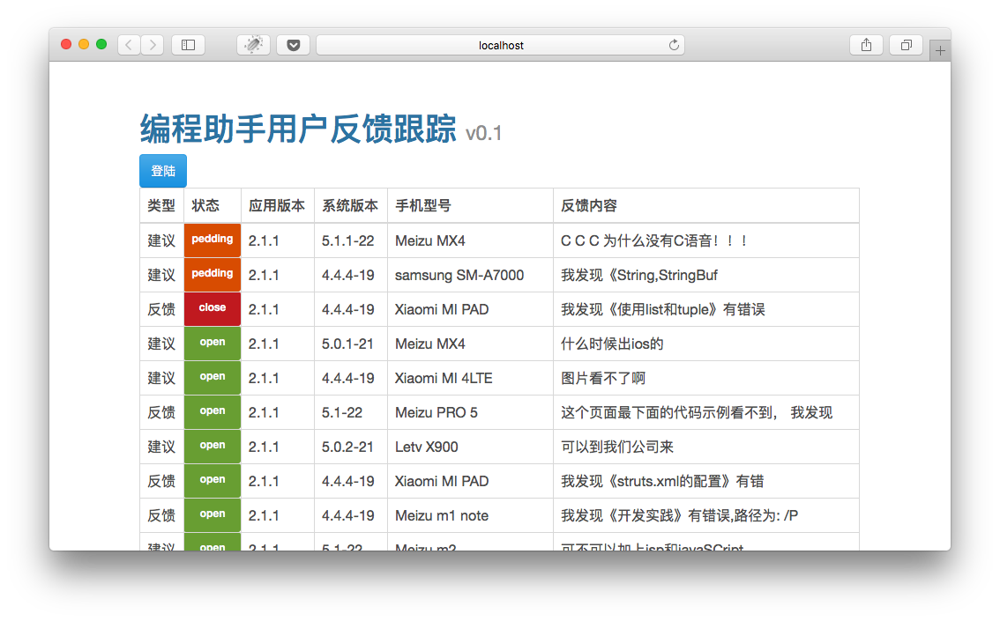

## issue trace



## Features

- Equip with React 0.14, ES6 & Babel 6
- Lint with ESlint and Airbnb's .eslintrc
- Build with Webpack
- Support [hot module replacement](https://webpack.github.io/docs/hot-module-replacement.html)
- Auto Open a new browser tab when Webpack loads, and reload the page when you modified the code
- Support git pre-commit hook used to lint and test your code

## How to use

First, you should clone the repo and install the dependencies.

```bash
$ git clone git@github.com:EManual/issue-trace.git
$ cd issue-trace
$ npm install
```

Then, launch the boilerplate app.

```bash
$ npm start
```

You should see a new browser tap opening and a title of "Hello World" in http://127.0.0.1:8080.

From there, you start to develop your own code in the `app` directory. When you finish coding, use `npm run build` or `npm run deploy` to build the static files.

## License

Apache V2
